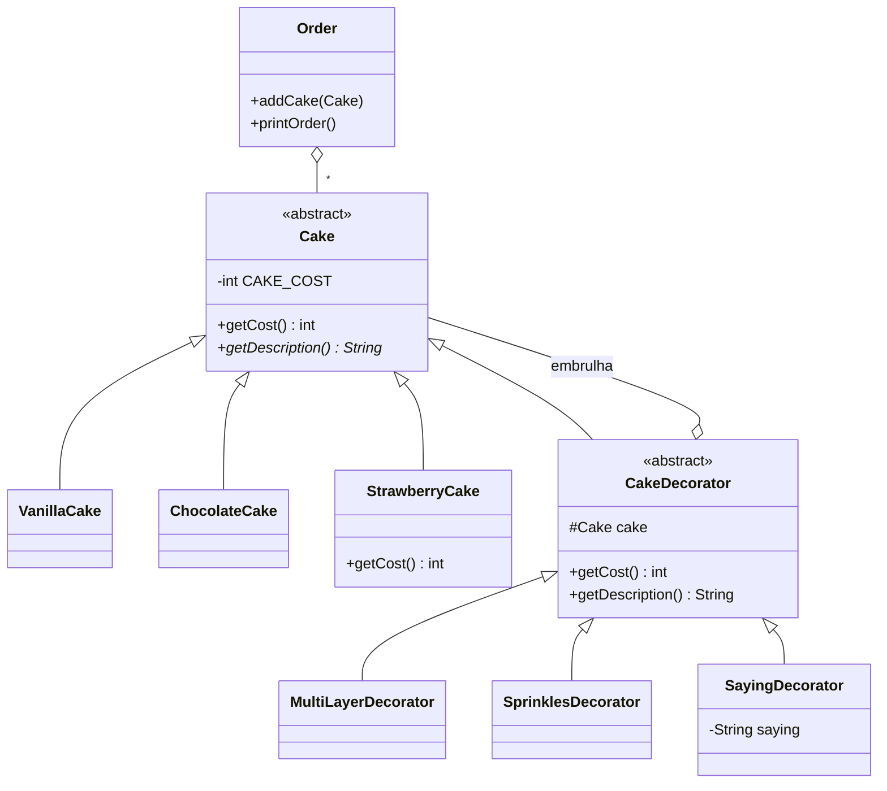

# Padrão Decorator — Padaria (bakery)

Lista Avaliativa I — Padrões de Projetos Orientados a Objetos.

Bolos complexos são montados **embrulhando** um bolo simples em decoradores. Cada decorador é um `Cake`
e tem um `Cake`, acrescentando custo e/ou texto à descrição.

## Papéis do padrão

| Papel no Decorator | Classe |
|---|---|
| Componente | `Cake` |
| Componentes concretos | `VanillaCake`, `ChocolateCake`, `StrawberryCake` |
| Decorador abstrato | `CakeDecorator` |
| Decoradores concretos | `MultiLayerDecorator` (+$5, prefixo), `SprinklesDecorator` (+$2), `SayingDecorator` (+$0) |

## Observações do enunciado
- **Novo tipo de bolo não altera código existente:** `StrawberryCake` foi criado sem tocar em `Cake`,
  `Order` ou nos outros bolos (usa `super.getCost() * 2`).
- **Nova decoração não altera código existente:** cada decorador é uma classe nova que estende
  `CakeDecorator`; `Order` só conhece `Cake`.



## Como executar (a partir da raiz do repositório)

```bash
javac -encoding UTF-8 -d out bakery/*.java
java -cp out Main
```

Saída:

```
   10  Chocolate cake
   10  Vanilla cake with saying "PLAIN!"
   12  Vanilla cake with sprinkles with saying "FANCY!"
   29  Multi-layered Strawberry cake with sprinkles with sprinkles with saying "One of" with saying "EVERYTHING"
```

## Uso de IA
Prompts, tutorial e ajustes estão em [PROMPTS.md](PROMPTS.md). A evolução da solução pode ser lida no
histórico de commits: um commit por passo do tutorial + um commit por ajuste.
